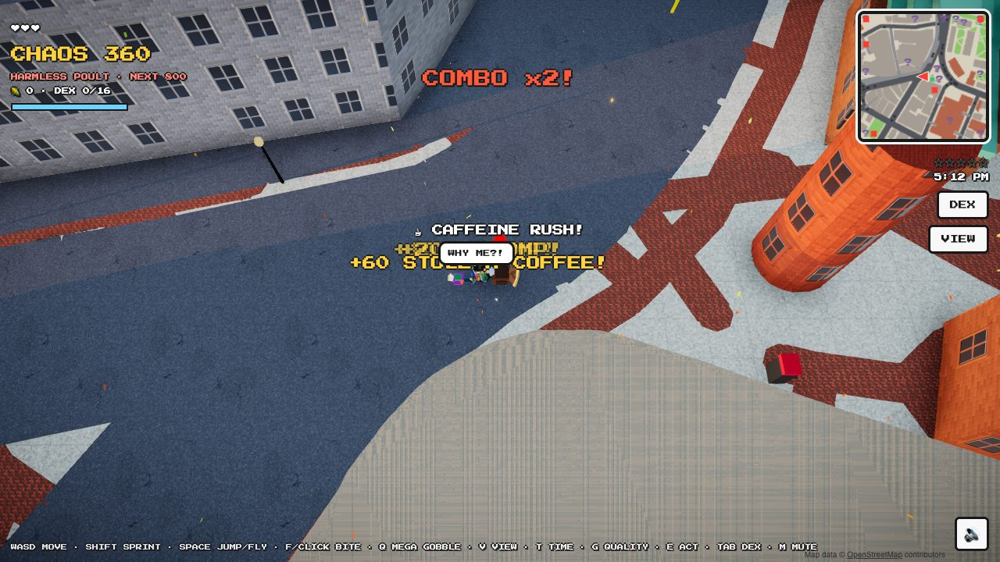

# 🦃 Harvard Square Turkey

GTA, but you're one of the wild turkeys of **Harvard Square, Cambridge**. The streets, 1,000+
buildings, Harvard Yard, Cambridge Common and the Charles are the real ones, built from
OpenStreetMap. Bite people, steal their lunch, fly over the rooftops, and rise from *Harmless Poult*
to **Turkey King of Harvard Square** while Animal Control and the HUPD try to stop you.

**Play:** https://luke-mcevoy.github.io/turkey-crossing/

**On your phone:** open the link, then *Share → Add to Home Screen* (iPhone) or *Install app*
(Android). It runs full screen and works offline.



📖 **[How to play: full guide with examples and screenshots →](docs/HOW_TO_PLAY.md)**

## Controls

| Action | Keyboard / mouse | Phone |
| --- | --- | --- |
| Move / sprint | WASD or arrows / hold Shift | Drag the left side (push far to sprint) |
| Jump, fly, glide | Space (tap in the air to flap, hold to glide) | FLAP |
| Bite (dive bomb in mid-air) | F or click | BITE |
| Mega Gobble shockwave | Q (unlocks at *Nuisance*) | GOBBLE |
| Talk / play arcade | E | E |
| Top-down ↔ turkey-eye view | V (+ mouse to look) | VIEW (+ drag the right side) |
| Landmarkdex / mute / zoom | Tab / M / mouse wheel | DEX / 🔊 |
| Time of day / graphics quality | T / G | |

## Quick examples

- **Start a combo:** run into a crowd on Mass Ave and press **F** again and again. Every bite within
  about 3 seconds raises your multiplier (up to x10). Grab the food people drop to heal.
- **Escape the cops:** at ★★★ HUPD cruisers join Animal Control. Press **Space**, then tap it again
  in the air to flap up onto a rooftop where they can't reach you.
- **Dive bomb:** fly up, steer over a crowd, and press **F** in mid-air to slam down with a shockwave.
- **Rampage:** touch a spinning red token and bite 10 people in 45 seconds for +2,500 chaos.
- **Sightseeing:** walk to the John Harvard statue, Widener, Mem Church and the rest to fill your
  16-entry Landmarkdex (**Tab**).
- **Jump to a spot:** [Old Yard](https://luke-mcevoy.github.io/turkey-crossing/?at=118,-100) ·
  [The Pit](https://luke-mcevoy.github.io/turkey-crossing/?at=-14,-11) ·
  [Mass Ave traffic](https://luke-mcevoy.github.io/turkey-crossing/?at=54,13) ·
  [Lampoon Castle](https://luke-mcevoy.github.io/turkey-crossing/?at=125,203) ·
  [The Charles](https://luke-mcevoy.github.io/turkey-crossing/?at=-262,420)

See [docs/HOW_TO_PLAY.md](docs/HOW_TO_PLAY.md) for step-by-step walkthroughs of every system.

## What's in it

- **Chaos:** bites, combos up to x10, stolen food (coffee gives a caffeine rush), dive bombs,
  and a Mega Gobble shockwave.
- **Wanted level:** Animal Control officers with nets; at 3★ HUPD cruisers join the chase.
- **Ranks and unlocks:** Mega Gobble, super sprint, a golden crown, a fire trail.
- **Rampage tokens:** timed bite challenges worth +2,500 chaos.
- **Landmarkdex:** 16 real landmarks (Johnston Gate, John Harvard statue, Widener, Mem Church, the
  Out of Town kiosk, the Lampoon Castle…), each with a true fact.
- **Turkey Crossing:** the original Crossy Road–style game, playable on the arcade cabinet in the
  Pit (or directly at [`crossing.html`](https://luke-mcevoy.github.io/turkey-crossing/crossing.html)).

## Development

No build step: plain ES modules, with Three.js loaded from a CDN.

```sh
python3 -m http.server 8000     # then open http://localhost:8000
# handy: ?at=x,z starts you anywhere (metres from the kiosk), ?debug exposes window.__tc
```

- `src/game/world.js` builds the city from `data/harvard.json`; `landmarks.js` has the hand-built
  landmarks and the Landmarkdex; `traffic.js` has cars, pedestrians and police; `main.js` has the
  player, chaos systems, HUD and camera.
- `src/game/graphics.js` is the rendering pipeline (physical sky, image-based lighting, N8AO ambient
  occlusion, bloom, colour grading, SMAA); `textures.js` draws every texture procedurally.
- To refresh the map: see `tools/build_map.py` (fetches from the Overpass API, writes `data/harvard.json`).
- `sw.js` caches the game for offline play. Bump `VERSION` in it when shipping big changes.

Map data © [OpenStreetMap](https://www.openstreetmap.org/copyright) contributors (ODbL).
