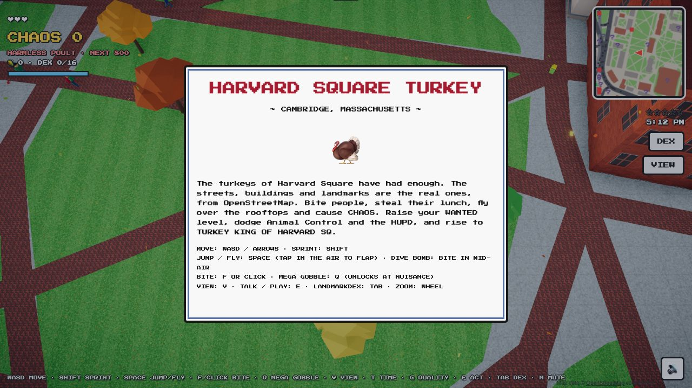
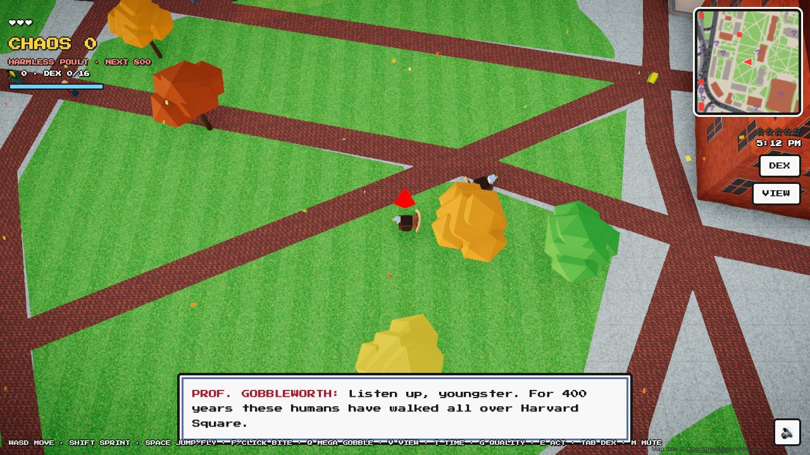
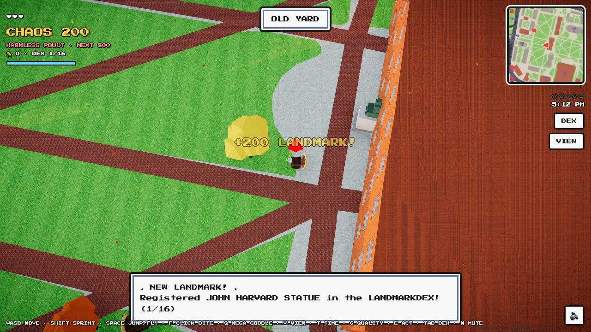
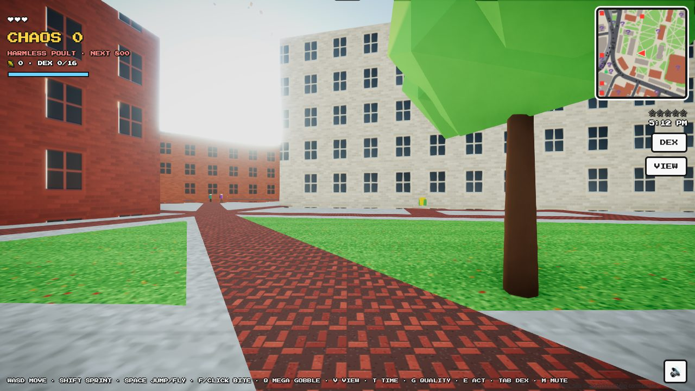
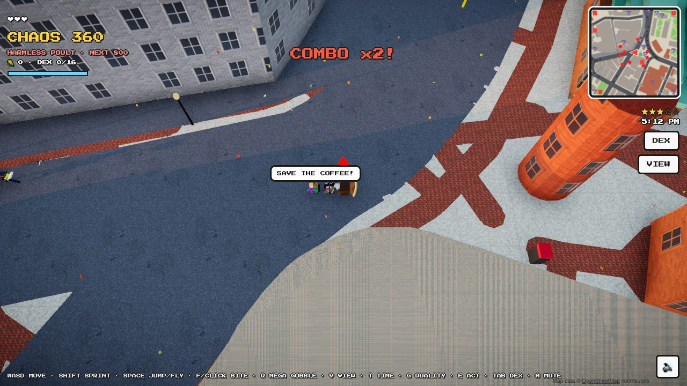
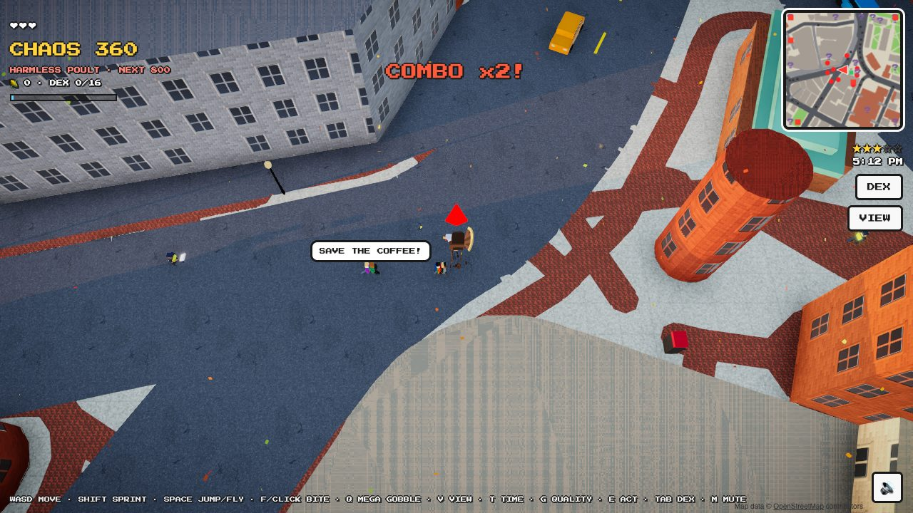
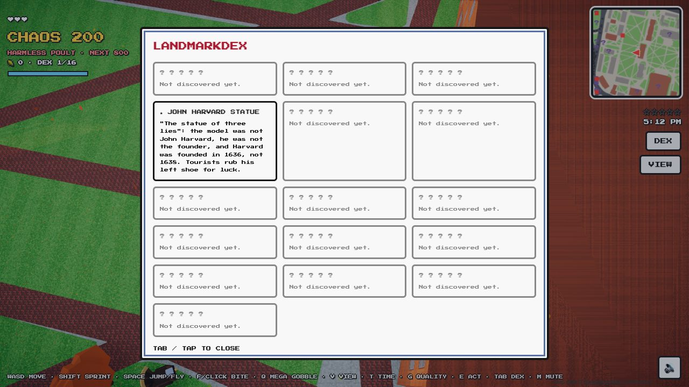

# How to play Harvard Square Turkey

**Play:** https://luke-mcevoy.github.io/turkey-crossing/

You are one of the wild turkeys of Harvard Square. The goal is to cause as much **chaos** as you
can, climb the ranks from *Harmless Poult* to **Turkey King of Harvard Square**, and fill your
**Landmarkdex** with the Square's real landmarks.

---

## Controls

| Action | Keyboard / mouse | Phone |
| --- | --- | --- |
| Move | WASD or arrow keys | Drag on the left half of the screen |
| Sprint | Hold **Shift** | Push the stick all the way out |
| Jump / fly / glide | **Space** (tap again in the air to flap, hold to glide) | **FLAP** |
| Bite | **F** or left click | **BITE** |
| Dive bomb | Bite while high in the air | **BITE** in the air |
| Mega Gobble | **Q** (unlocks at *Nuisance*) | **GOBBLE** |
| Talk / play the arcade | **E** | **E** |
| Top-down ↔ turkey-eye view | **V** (in turkey-eye view, click and use the mouse to look) | **VIEW**, then drag the right half to look |
| Landmarkdex | **Tab** | **DEX** |
| Time of day (8:30 AM / noon / 3 PM / 5 PM) | **T** | |
| Graphics quality (high / low) | **G** | |
| Zoom / mute | Mouse wheel / **M** | 🔊 |

**Install it on your phone:** open the link, then *Share → Add to Home Screen* (iPhone) or
*⋮ → Install app* (Android). It opens full screen like a normal app.

---

## The HUD at a glance

- **Top left:** hearts (health), **CHAOS** score, your rank and the next rank's target, corn and
  Landmarkdex counts, and the blue **flight energy** bar.
- **Top right:** the mini-map, then your **wanted stars** and the clock.
  - On the mini-map, `?` marks an undiscovered landmark, `★` one you've found, a red square a
    rampage token, a green square the arcade, and flashing red/blue dots the police.
- **Top centre:** a location banner whenever you enter a new area ("OLD YARD", "MASSACHUSETTS
  AVENUE"…), and your **COMBO** multiplier.

---

## Example 1: Your first five minutes

1. Press any key. **Prof. Gobbleworth**, the old turkey in the Old Yard, explains the basics. Press
   **Enter** or **E** to advance his dialog. You can walk back and talk to him (**E**) any time to
   check your rank.

   

2. You start right next to the **John Harvard statue**. Walk up to it and it's added to your
   Landmarkdex, which is worth +200 chaos.

   

3. Press **V** to see the Yard at turkey height, then **V** again to go back to the top-down
   view.

   

4. Head west (left) out of **Johnston Gate** toward Mass Ave and the Pit, where the crowds are.

---

## Example 2: Start a rampage combo

1. Find a group of students on a busy sidewalk (Mass Ave by the Coop or the Pit is perfect).
2. Run up behind someone and press **F**.
   - They scream, fall over, and often **drop their food**.
   - Everyone nearby panics and runs.
3. **Keep biting.** Each bite within about 3 seconds of the last raises your **COMBO** (x2, x3, up
   to x10), and that multiplier applies to every point you earn.
4. Grab the dropped food. A sandwich, bagel, pizza or burrito heals a heart, and coffee gives you a
   **caffeine rush** (35% faster for 6 seconds).

> **Tip:** knocking people down while they're already running away still counts. Chase the crowd!

---

## Example 3: Survive a 3-star chase

Every bite raises your **wanted level**.

| Stars | Who comes after you |
| --- | --- |
| ★ | Animal Control officers on foot, carrying nets |
| ★★ | More officers, and they run faster |
| ★★★ and up | **HUPD cruisers** with sirens join and try to ram you |

If an officer touches you, you're **BUSTED**: you lose half your chaos and get sent back to the Old
Yard. Ways out:

1. **Bite the officer** (F). They go down for a few seconds, and you get +300 chaos.
2. **Fly.** Press Space to jump, then tap Space again and again to flap upward. Land on a rooftop.
   Officers can't climb, and cruisers can't follow.

   

3. **Lie low.** If you stop committing crimes for about 7 seconds and stay away from officers, the
   stars drain away. "YOU LOST THEM!" means you're clear.

> **Watch your blue energy bar:** each flap costs energy, and it only refills while you're standing on
> something. Hold Space while falling to glide down slowly.

---

## Example 4: Dive bomb and Mega Gobble

- **Dive bomb:** fly up a few metres, steer over a crowd, then press **F** in mid-air. You slam into
  the ground with a shockwave that knocks over everyone within about 7 m.
- **Mega Gobble (Q):** unlocks at the *Nuisance* rank (800 career chaos). It's an 11 m shockwave
  that flattens people and stuns officers, with an 8-second cooldown. The HUD shows when it's ready.

Combining them works well. Dive bomb into the Pit, Mega Gobble the survivors, then bite whoever is
left while your combo is still running.

---

## Example 5: Rampage tokens

Spinning **red tokens** (red squares on the mini-map) are scattered around the Square. Touch one to
start a **RAMPAGE: bite 10 people in 45 seconds.**

- **Success:** +2,500 chaos and full health.
- **Failure:** nothing lost, and the token comes back after about 90 seconds.

There's a token on JFK Street near Winthrop Park. [Start right next to it](https://luke-mcevoy.github.io/turkey-crossing/?at=-118,118).

---

## Example 6: Ranks and unlocks

Career chaos is saved in your browser and never goes down, even when you're busted.

| Rank | Career chaos | Unlock |
| --- | --- | --- |
| Harmless Poult | 0 | |
| Nuisance | 800 | **Mega Gobble** (Q) |
| Menace | 2,500 | **Super sprint** (25% faster) |
| Public Enemy | 6,000 | **Golden crown** |
| Cambridge Legend | 12,000 | **Fire trail** when sprinting |
| Turkey King of Harvard Sq | 25,000 | Bragging rights |

**Fastest ways to earn chaos:** long bite combos, rampages (+2,500), bonking officers (+300 each),
and landmarks (+200 each).

---

## Example 7: Complete the Landmarkdex (16 landmarks)

Walk within a few metres of each landmark to register it. Press **Tab** to see the facts you've
unlocked. Here's a route that covers all of them:

1. **John Harvard Statue** (right next to the spawn point)
2. **Memorial Church** (north across Tercentenary Theatre)
3. **Widener Library** (opposite Mem Church)
4. **Massachusetts Hall**
5. **Johnston Gate**
6. **Charles Sumner Statue** (just outside the gate)
7. **First Parish Church**
8. **Christ Church** (heading north up Garden St)
9. **Cambridge Common**
10. **Brattle Theatre** (back south down Brattle St)
11. **The Harvard Coop**
12. **Out of Town News Kiosk**
13. **Harvard T Station**
14. **Smith Campus Center**
15. **Harvard Lampoon Castle** (Mt Auburn St and Bow St)
16. **Weld Boathouse** (south to the river; turkeys can't swim, but they can fly over the Charles)

---

## Example 8: Jump straight to a spot

Add `?at=x,z` to the link to start anywhere. The numbers are metres from the Harvard Square kiosk:
x is east and z is south. These are handy for sharing a spot with friends:

| Spot | Link |
| --- | --- |
| Old Yard (default spawn) | https://luke-mcevoy.github.io/turkey-crossing/?at=118,-100 |
| Johnston Gate | https://luke-mcevoy.github.io/turkey-crossing/?at=30,-147 |
| The Pit (arcade cabinet) | https://luke-mcevoy.github.io/turkey-crossing/?at=-14,-11 |
| Mass Ave traffic | https://luke-mcevoy.github.io/turkey-crossing/?at=54,13 |
| Widener steps | https://luke-mcevoy.github.io/turkey-crossing/?at=204,-55 |
| Memorial Church | https://luke-mcevoy.github.io/turkey-crossing/?at=238,-150 |
| Harvard Lampoon Castle | https://luke-mcevoy.github.io/turkey-crossing/?at=125,203 |
| Brattle Theatre | https://luke-mcevoy.github.io/turkey-crossing/?at=-210,-7 |
| Cambridge Common | https://luke-mcevoy.github.io/turkey-crossing/?at=-172,-384 |
| Weld Boathouse and the Charles | https://luke-mcevoy.github.io/turkey-crossing/?at=-262,420 |

---

## Example 9: The arcade mini-game

In **the Pit**, next to the T station, there's an arcade cabinet (the green square on the mini-map).
Walk up to it and press **E** to play **Turkey Crossing**, the original Crossy Road–style game.

- Arrow keys or WASD hop; on a phone, tap or swipe.
- **◀ HARVARD SQ** takes you back to the open world, right next to the cabinet.

---

## Tips

- Cars mostly brake for turkeys, **but about 1 in 7 drivers won't**. Cross Mass Ave with care, or
  flap over a car to dodge it.
- If you lose all three hearts, you faint and wake up in the Old Yard. Your career chaos is kept.
- If the game feels choppy, press **G** to switch to low graphics quality. Phones start on low
  automatically.
- Your progress (rank, Landmarkdex, corn) is saved in this browser on this device.
